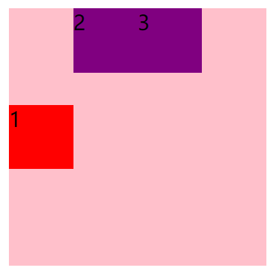

[toc]

# 什么是flex(个人理解)

flex是一种可以进行*快速布局*的的方式,它支持等分,头尾贴合等分,顺序排列等多种布局方式

不需要向传统布局一样,需要清除浮动

# flex优缺点

> 优点: 快捷方便的布局
>
> 缺点: 兼容性较差(IE?), 一些浏览器不支持或只支持部分

# 容器和子项目

> 容器: 可以理解为你要进行切分的单位
>
> 子项目: 可以理解为切分后的各个部分

# 容器属性

## 最初的演示

```html
<!DOCTYPE html>
<html lang="en">
<head>
    <meta charset="UTF-8">
    <title>Title</title>
    <link rel="stylesheet" href="./flexText.css">
</head>
<body>
    <!--定义容器和项目-->
    <div class="container">
        <div class="item">1</div>
        <div class="item">2</div>
        <div class="item">3</div>
    </div>
</body>
</html>
```

```css
/*这是最初的演示*/
.container {
    /*这是在声明一个容器*/
    display: flex;

    height: 200px;
    width: 200px;
    background: pink;
    opacity: 0.5;
}

.item {
    height: 50px;
    width: 50px;
    margin: 0 10px;
    background: purple;
}
```

演示的结果是,三个子项目不再是*流式布局*,也就是独占一行,而是变成类似*内联元素*,排列在同一行


## flex-direction 设置主轴和侧轴

子项目会在主轴上,单独排成一行,通过flex-direction可以设置主轴为y轴(默认为x轴)

```css
    /*这里改变主轴为y轴*/
    flex-direction: column;
```

设置后,子项目的排序类似与*流式布局*,是竖着的


*主轴和侧轴的区分:*

> 当主轴是x轴时,侧轴是y轴
>
> 当主轴是y轴时,侧轴是x轴


| 属性值         | 描述                        |
| -------------- | --------------------------- |
| row            | 设置主轴为x轴正方向(默认值) |
| row-reverse    | 设置主轴为x轴负方向         |
| column         | 设置主轴为y轴正方向         |
| column-reverse | 设置主轴为y轴负方向         |

四种效果展示:

row


row-reverse


column


column-reverse


## justify-content 设置子项目在主轴上的排列方式

| 属性值        | 描述                                                         |
| ------------- | ------------------------------------------------------------ |
| flex-start    | 从头开始排列                                                 |
| flex-end      | 从尾开始排列                                                 |
| center        | 从中间往两边排列                                             |
| space-around  | 平均分配剩余空间                                             |
| space-between | 第一个子项目和最后一个子项目贴合容器,剩余子项目平均分配剩余空间 |
| space-evenly  | 子项目之间间隔相同                                           |


## flex-wrap 设置主轴是否换行

flex-wrap默认是不换行的,如果是放入的子项目总长度大于容器的长度,那么flex会改变每个子项目的长度,也就是说,你为子项目设置的长度将失效

| 属性值 | 描述           |
| ------ | -------------- |
| wrap   | 换行           |
| nowrap | 不换行(默认值) |


```css
.item {
    /*更改了子项目长度*/
    height: 50px;
    width: 80px;
    background: purple;
}
```

3个子项目的长度为240,大于容器的长度200

示例如下


在容器类中

```css
    /*设置换行*/
    flex-wrap: wrap;
```

运行结果为


## align-items 当主轴是单行时, 调整该行在侧轴上的排列方式

flex除了可以设置子项目在主轴上的排列方式,也能够设置在侧轴上的排列方式

| 属性值     | 描述     |
| ---------- | -------- |
| flex-start | 侧轴开始 |
| flex-end   | 侧轴结束 |
| center     | 侧轴中心 |
| stretch    | 设置拉伸 |


示例: 实现三个子项目位于中心


```css
    /*这里设置子项目在主轴上的排列方式*/
    justify-content: center;

    /*这里设置单行的子项目在侧轴上的排列方式*/
    align-items: center;
```


## align-content 当主轴是多行时, 调整多行在侧轴上的排列方式

当子项目在主轴上排列成多行时,align-items属性值将失效,如果还想要设置其在侧轴上的排列,需要使用align-content属性

```css
    /*这里设置多行子项目目在侧轴上的排列方式*/
    align-content: center;
    /*这里设置子项目在主轴上的排列方式*/
    justify-content: center;
    /*设置换行*/
    flex-wrap: wrap;
```


## flex-flow 是flex-direction 和flex-flow的缩写

```css
    /*这里是便捷写法*/
    flex-flow: column wrap;
```

# 子项目属性

## flex-basis设置子项目在主轴上的基础长宽

```css
    /*由于主轴是x轴,所以这个设置会覆盖width的值*/
    flex-basis: 20px;
```


```css
	/*如果主轴是y轴,所以这个设置会覆盖height的值*/
    flex-basis: 20px;
```


## flex-grow设置子项目扩大时,剩余空间中扩大的份数

html文件

```html
<body>
    <div class="container">
         <!--有两个子项目-->
        <div class="item">1</div>
        <div class="item">2</div>
		<!--<div class="item">3</div>-->
    </div>
</body>
```

css文件

```css
.container {
    /*这是在声明一个容器*/
    display: flex;

    height: 200px;
    width: 200px;
    background: pink;
}

/*第一个子项目*/
.container div:first-child{
    flex-basis: 20px;
    flex-grow: 3;
    background: red;
    height: 50px;
}

/*第二个子项目*/
.container div:last-child{
    flex-basis: 80px;
    flex-grow: 2;
    background: deepskyblue;
    height: 50px;
}

```

运行结果

*计算方式:*

> 剩余空间 = 容器宽度200-第一个子项目20-第二个子项目80=100
>
> 每份宽度 = 100 / (2 + 3) = 20
>
> 第一个子项目宽度 = 20*3扩展宽度 + 原本宽度20 = 80
>
> 第二个子项目宽度 = 20*2扩展宽度 + 原本宽度80 = 120


### flex-grow: 0(数字) 表示不扩大


## flex-shrink设置子项目缩小时,缩小超出部分的份数

### flex-shrink: 0(数字) 表示不缩小

```css
.container div:first-child{
    flex-basis: 100px;
    flex-shrink: 0;
    background: red;
    height: 50px;
}

.container div:last-child{
    flex-basis: 150px;
    flex-shrink: 0;
    background: deepskyblue;
    height: 50px;
}
```


## flex flex-grow flex-shrink flex-basis的简写(顺序不变)

*flex的特殊写法:*

## align-self 独立于容器的设置,单独进行排序

align-self允许子项目独立进行侧轴排列方式

```css
/* 寻找到具有container类的标签,其下的第一个div */
.container div:nth-child(1){
    /* 侧轴上排列方式为center */
    align-self: center;
    background: red;
}
```

运行结果

