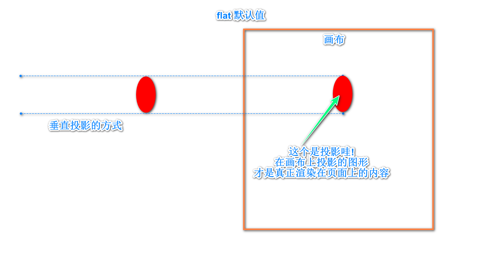
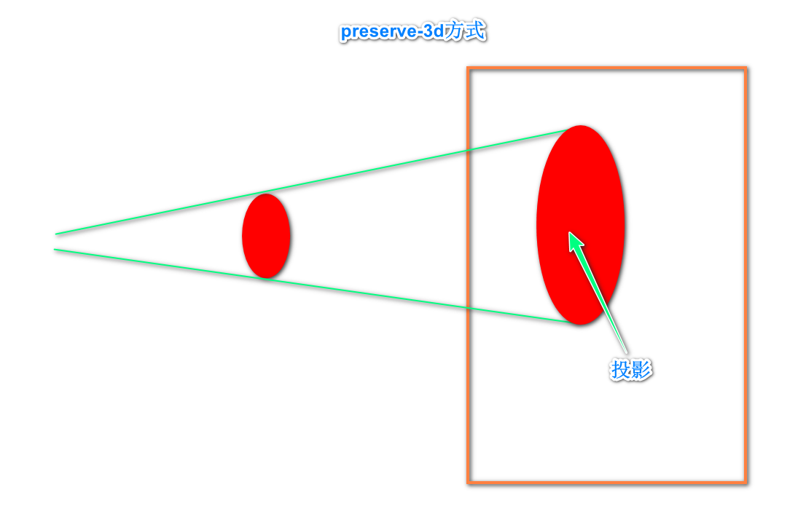
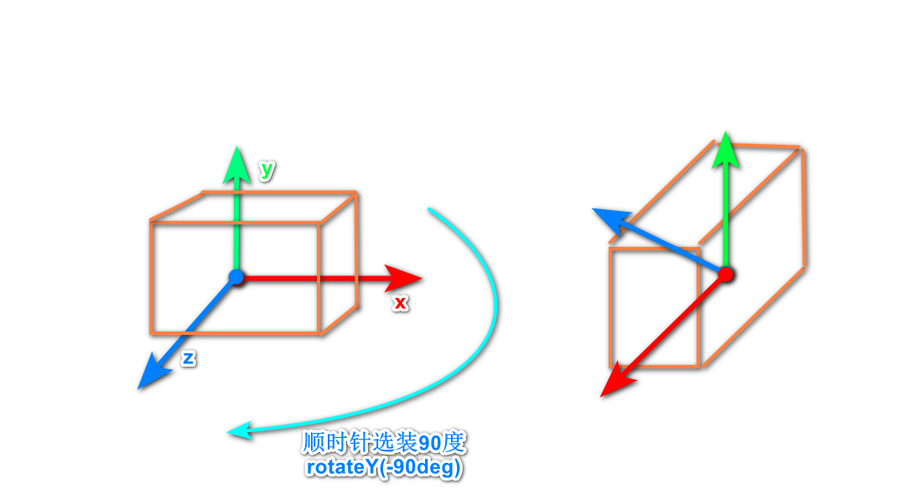
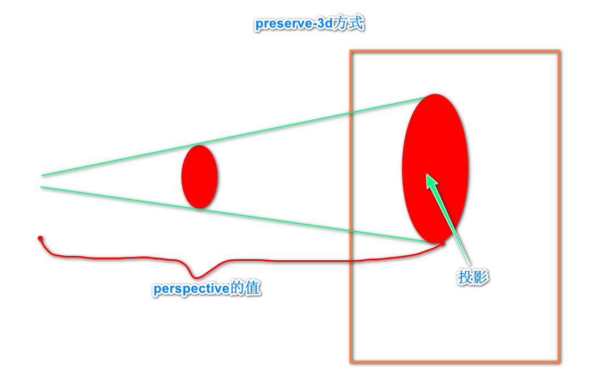

[toc]

## transform-style 指定投影的类型

### 1.flat(默认值)

### 2.preserve-3d

​	和unity中相机的投影方式是一样的

## transformX transformY transformZ

元素的坐标轴是**局部坐标轴**(不是全局的绝对坐标轴), 方向也会随着旋转而改变

类比unity中有**绝对坐标和相对坐标**

transform改变的应该是**相对坐标(以父元素为起点)**

画布所在位置应该是**绝对左边原点处的xOy平面?**还是在父元素中心点所在的并且垂直绝对z轴的平面(毕竟perspective是加在父元素上的)

## perspective 距离画布的距离

具体参考

[css3系列之详解perspective - 杨耿 - 博客园 (cnblogs.com)](https://www.cnblogs.com/yanggeng/p/11285856.html)