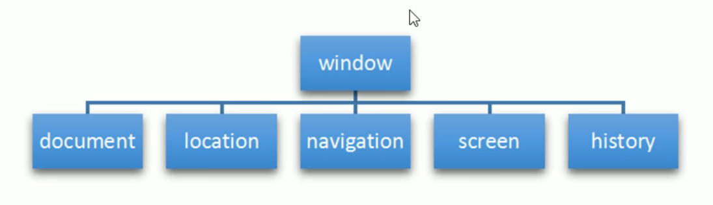
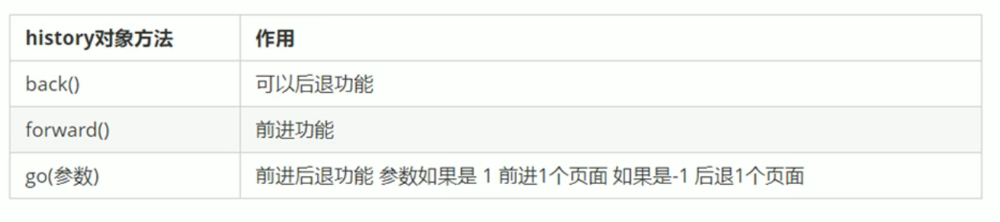
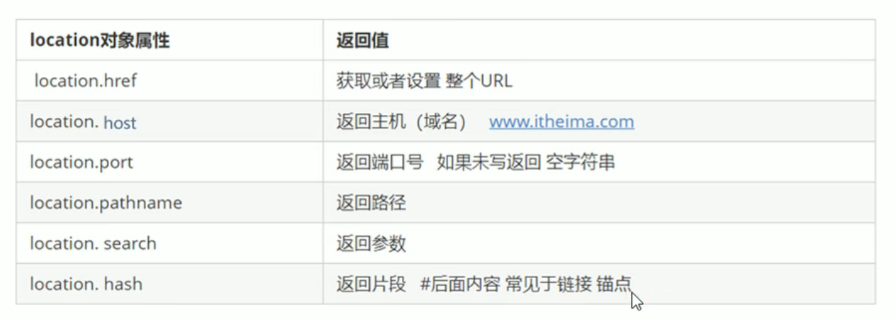

[toc]

## 结构图

## window窗口对象

window是顶级对象,所有全局变量都会是window对象的属性

```js
var n = 10
console.log(n)
console.log(window.n) // 是等价的
```

alert和prompt等都是window的方法

之前之所以不能够用name作为变量名

是因为**存在window.name**这个属性

```js
console.log(window.name)
```


## history下一跳和上一跳


## location记录url地址对象




## navigator浏览器信息对象

navigator.userAgent获取浏览器所在的操作系统,浏览器信息等