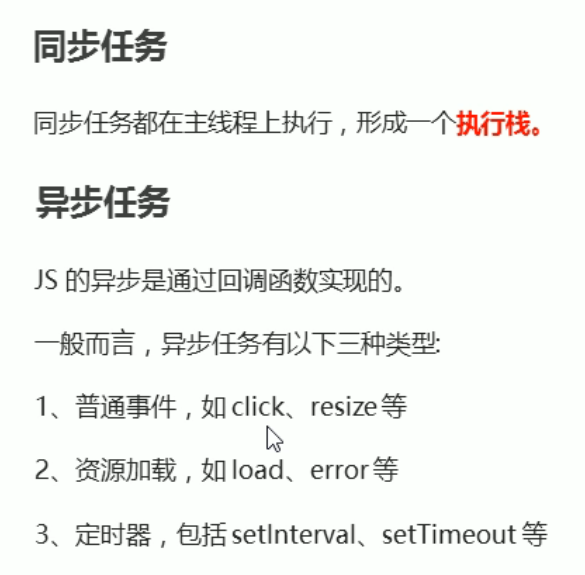
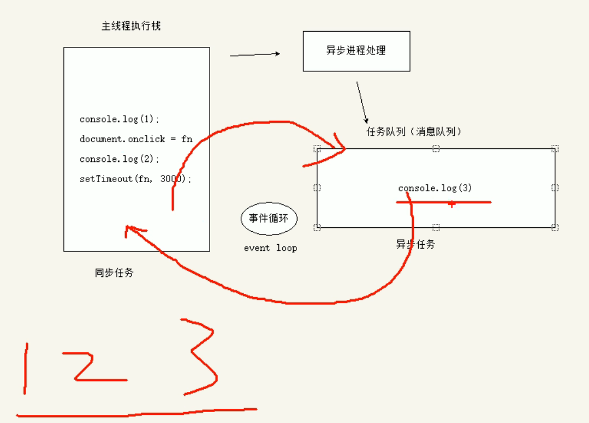

[toc]

# js是单线程的

## js通过事件队列实现并发

优先同步任务,最后执行异步任务




## 验证案例一

```js
console.log(1)
setInterval(function (){
    console.log(2)
}, 0)
console.log(3)

// 输出结果 1 3 2
```


## 具体流程



> 先执行同步任务
>
> 异步任务交给异步处理程序
>
> 满足异步任务触发条件时,比如点击按钮触发点击事件
>
> 异步处理程序将任务添加到任务队列
>
> 主线程执行完同步任务,循环访问任务队列
>
> 执行其中的任务


## 验证案例二: 同步任务的优先级永远最高

```js
setInterval(function (){
    console.log(2)
}, 2000)

for (var i=0; i<100000; i++){
    console.log(1)
}
```

结果是一直输出1,经过两秒后并没有输出2
