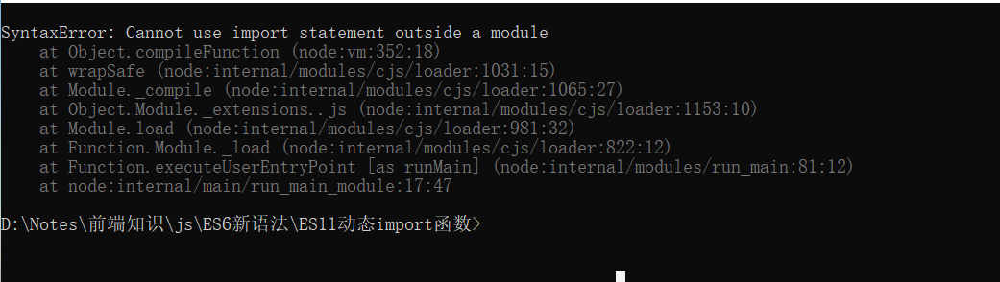
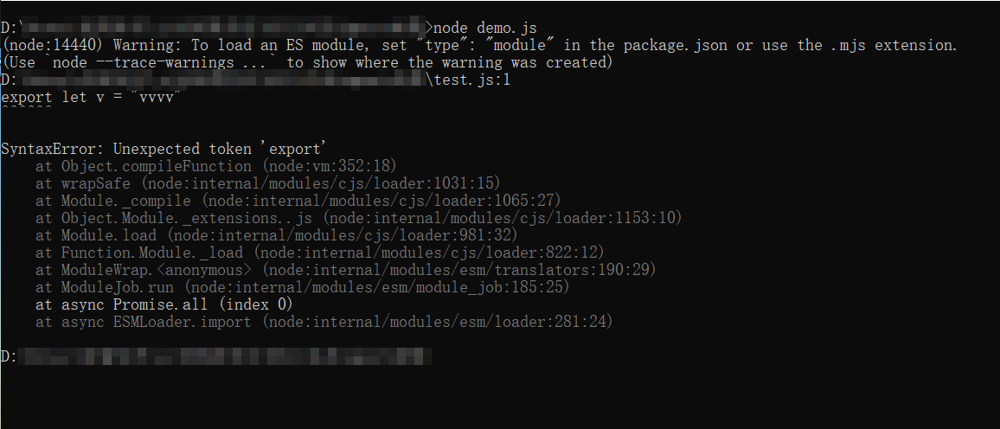

[toc]

## 动态import

```javascript
setTimeout(() => {
    // import函数含有一个promise对象, 成功时数据为 模块对象
    import("./test.js").then(value=>{
        console.log(value)
    }, reason=>{
        console.log(reason)
    })
}, 2000);
```


## 期间出现了错误, 简单的说, node和浏览器支持的js标准不同,相同语法在不同js标准下, 可能无法执行



参考[export报错SyntaxError: Unexpected token export_奋斗的小绿萝-CSDN博客_export 报错](https://blog.csdn.net/weixin_40817115/article/details/81534819)


## import函数好像node和浏览器都支持, import语法只有浏览器支持

```html
    <script>
        import("./test.js").then(module=>{console.log(module)}, reason=>{console.log(reason)})
    </script>
```


## node 执行import语句报错

