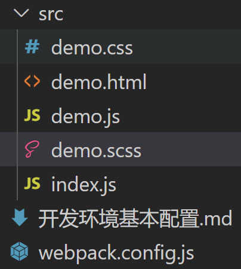

[toc]

## webpack 基本开发环境配置(webpack.config.js配置)

下载 webpack, webpack-cli 和 webpack-dev-server三个包


准备这样的目录结构



其中, index.js将作为**入口文件**, **引入其它所有文件, 并且用于打包**


**入口目录**

```javascript
// 入口文件可以引入所有类型文件,不过webpack只默认能处理js和json文件,
// 想要处理其他类型文件,需要下载和配置插件
import c1 from "./demo.css"
import sc1 from "./demo.scss"
import js1 from "./demo.js"
```


## 具体配置查看目录下webpack.config.js文件


其中遇到错误, 具体查看[webpack5用url-loader打包后出现图片打不开、资源重复_ChrisJin的博客-CSDN博客](https://blog.csdn.net/w184167377/article/details/118930758)
