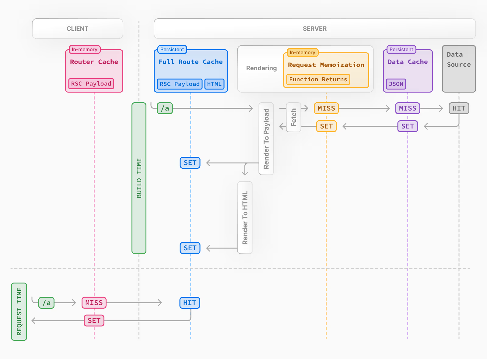
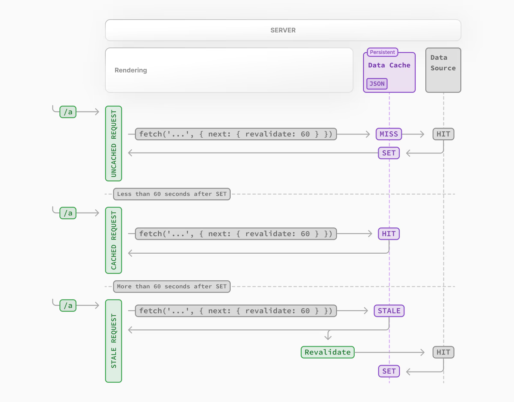

[toc]

# 0. 序言

​	这里仅对nextjs使用过程中需要注意的点做记录. 不会完整记录所有知识点, 忘了就看官网手册吧.


# 1. 路由

## 1.1 动态路由参数

nextjs中的动态路由如果想要获取多个路由参数(存在于路径中), 方式如下

```js
url='http://demo.com/[...path_args]' 匹配
url='http://demo.com/1/2/3'
```

path_args将作为**数组**存在[1,2,3]


## 1.2 路由与代码分割

url中以/分割的每个部分被称为**segment**, **segment是代码分割的依据之一; 除此之外, 使用React.Suspense可以在segment基础上进一步分割代码.**

将代码分割为不同的chunk, 这些chunk可以并行的解析和打包, 并发送给客户浏览器.


## 1.3 chunk的渲染

每个chunk的渲染分为两部分:

* 在服务端渲染

1. 在服务端渲染并保存为一种紧凑的二进制结构, 称为`RSC payload`
2. 在服务端中利用RSC和client component的JavaScript渲染出静态html

* 在客户端水和服务端数据

1. html快速显示

2. The React Server Components Payload is used to reconcile(调和一致) the Client and rendered Server Component trees, and update the DOM. (组合树)

3. The JavaScript instructions are used to [hydrate](https://react.dev/reference/react-dom/client/hydrateRoot)(水和[^hydrateRoot])Client Components and make the application interactive.

   

[^hydrateRoot]: 它可以将React Node挂载到已经被服务器渲染的dom节点上


**RSC payload包含:**

1. server component的渲染结果;
2. 待渲染的client component占位符, 以及它们引用的JavaScript
3. server component传给client component的props


# 2. 缓存机制



nextjs中存在4种缓存:

(1) 黄色: 在单次请求中存在, 它的目的是减少单次请求中重复数据获取的次数. 意味着你可以在一次请求的多个地方调用多个相同的fetch请求, 但只执行一次, 不需要再通过props传输数据. fetch和React.cache都属于这个缓存类型.

(2) 紫色: 跨请求存在的缓存, 它的目的是减少多次请求中对数据的重复获取. 这些数据不依赖于请求的具体信息(如cookie或searchParams).比如每日热点啥的数据, 就是不依赖于特定请求数据的.

(3) 蓝色: 整个路由的缓存(在服务端), 这个缓存只在静态渲染中生效. 当一个router所有部分(所有segment, 即所有layouts和pages?)都没有**异步函数或未缓存数据**时, 它是静态的.

(4) 红色: 客户端路由缓存(在客户端), **这个缓存无论是静态页面还是动态页面都生效**, 只有期限过期(通常是5分钟)或手动调用revalidatePath, router.refresh等才会刷新这个缓存, 并从服务端重新获取页面并更新缓存.

更具体的请参考[Building Your Application: Caching | Next.js](https://nextjs.org/docs/canary/app/building-your-application/caching#request-memoization)


## 2.1 动态渲染和静态渲染

* 只要存在[^未缓存的数据]或是[^动态函数]就是动态渲染, 动态渲染的结果只有在请求到来时才能得知, 无法预渲染.

[^未缓存的数据]: fetch('...', {cache : 'no-store'})
[^动态函数]: 含有cookie的获取, 或依赖于searchParams

* 除此之外就是静态渲染

所谓的动态渲染, 在未命中缓存4的前提下, 会跳过缓存3, 也就是每个请求都会在服务端渲染一次. 而不是只预渲染一次. 但是仍然会使用缓存2和缓存1.

因此动态渲染的页面, 每次请求都会重新执行所有未缓存的数据获取.


## 2.2 部分渲染(Partial Prerender)

部分渲染可以使一个路由部分使用静态渲染, 而部分使用动态渲染. 但这个特性还是实验性质的.

原来的router, 只要存在一个动态路由的因素, 就完整的是动态路由, 全部内容每次都需要服务端渲染.

文档内容: 

>Partial Prerendering (PPR) enables you to combine static and dynamic components together in the same route.
>
>During the build, Next.js prerenders as much of the route as possible. If [dynamic](https://nextjs.org/docs/app/building-your-application/rendering/server-components#dynamic-rendering) code is detected, like reading from the incoming request, you can wrap the relevant component with a [React Suspense](https://react.dev/reference/react/Suspense) boundary. The Suspense boundary fallback will then be included in the prerendered HTML.


## 2.3 Stable while revalidate

基于时间的重认证, 在过期时的一次请求将会获取不新鲜的数据, 之后再更新不新鲜的数据.

如果使用主动的刷新方式, 那么会等待最新的数据.




# 3. 安全

## 3.1 将Server Action视为普通的请求访问,如有必要你需要对它进行权限验证

## 3.2 在router handle中设置cookie.set将会导致客户端路由缓存刷新, 但不会马上生效.

## 3.3 next-auth使用注意事项

在使用provider中的认证方式时, 如果认证失败是通过抛出异常来显示错误的. 该错误需要你来捕获.

待补充...

