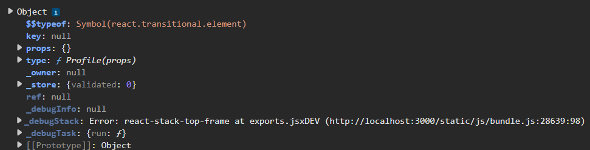

[toc]

# 0. 序言

​	简单的react知识就不记录了, 比如react是JavaScript库. react的数据不变性, 单向数据流, 组件化等.

​	笔记记录一些比较重要的部分.

​	参考[3-什么是JSX？_哔哩哔哩_bilibili](https://www.bilibili.com/video/BV1LV411m7cq/?p=4&spm_id_from=333.1007.top_right_bar_window_history.content.click&vd_source=adc8614d6ca1140f400db0450edf8018)

# 1. jsx语法糖

​	**jsx本质是语法糖**. 来到babel官网, 在try it out中输入:

注意, 记得**勾选左侧边栏的react和修改React Runtime为Classic**.

```jsx
import React from 'react';
const ele = <div><span>Hello world</span></div>;
function Cmp() {
  return <div>Hello cmp</div>
}
console.log(<Cmp/>)
```

得到输出

```js
import React from 'react';
const ele = /*#__PURE__*/React.createElement("div", null, /*#__PURE__*/React.createElement("span", null, "Hello world"));
function Cmp() {
  return /*#__PURE__*/React.createElement("div", null, "Hello cmp");
}
console.log(/*#__PURE__*/React.createElement(Cmp, null));
```

浏览器无论如何**只识别js, html和css等三剑客**.

在React17+中, 转换后为

```js
import { jsx as _jsx } from "react/jsx-runtime";
const ele = /*#__PURE__*/_jsx("div", {
  children: /*#__PURE__*/_jsx("span", {
    children: "Hello world"
  })
});
function Cmp() {
  return /*#__PURE__*/_jsx("div", {
    children: "Hello cmp"
  });
}
console.log(/*#__PURE__*/_jsx(Cmp, {}));
```

**jsx-runtime是自动导入的, 用jsx-runtime取代React, 就不需要手动import引入React了.**

# 2. 打印

直接打印react标签(React.createElement返回的结果)



轻便很多

# 3. 使用babel命令行工具进行转换

如果只需要对某些文件进行转换, 可以使用babel-cli工具

```powershell
pnpm add --save-dev @babel/core @babel/cli @babel/preset-env
```

安装适配react的预设

```powershell
pnpm add --save-dev @babel/preset-react babel-preset-react-app
```

其中@babel/preset-react由官方维护, babel-preset-react-app由cra维护.

调用小面的代码进行转换

```powershell
./node_modules/.bin/babel app/server.js --out-dir lib --presets=@babel/react
```

这里转换

```jsx
const React = require("react")
const ReactDomServer = require("react-dom/server")
const express = require("express")

const app = express();

const html = ReactDomServer.renderToString(
  <p>Hello react</p>
);

// 下面的写法不需要babel转换也可以执行
/*const html = ReactDomServer.renderToString(
  React.createElement("p", {}, "Hello react")
);*/

console.log(html);

app.get('/', (req, res) => {
  res.send(`
    <!DOCTYPE html>
    <html lang="en">
      <head>
        <meta charset="utf-8" />
        <meta name="viewport" content="width=device-width, initial-scale=1" />
        <title>React App</title>
      </head>
      <body>
        <div id="root">${html}</div>
        <script src="/bundle.js"></script>
      </body>
    </html>
    `);
});

app.listen(3000, () => {
  console.log('Server is running on port 3000');
});
```

**bug**: 

​	可能react项目使用的create-react-app创建的, 使用babel命令默认绑定babel-preset-react-app预设, 使用--presets=@babel/react改也没用. 不知道为啥.

​	修复, 根据调用栈信息, 在node_modules\babel-preset-react-app\create.js中添加 (很丑陋的办法, 但如果这是因为cra弃用导致的bug, 那就加吧)

```js
module.exports = function (api, opts, env) {
  if (!opts) {
    opts = {};
  }

  /* 我在这里添加了一行代码 */
  env = env || 'development'
  // ...
}
```

转换后为

```js
"use strict";

var _jsxFileName = "E:\\Note\\03Web\\01\u524D\u7AEF\\06lib\\06react\\my_react_app\\app\\server.js";
const React = require("react");
const ReactDomServer = require("react-dom/server");
const express = require("express");
const app = express();
const html = ReactDomServer.renderToString(/*#__PURE__*/React.createElement("p", {
  __self: void 0,
  __source: {
    fileName: _jsxFileName,
    lineNumber: 8,
    columnNumber: 3
  }
}, "Hello react"));
console.log(html);
app.get('/', (req, res) => {
  res.send("\n    <!DOCTYPE html>\n    <html lang=\"en\">\n      <head>\n        <meta charset=\"utf-8\" />\n        <meta name=\"viewport\" content=\"width=device-width, initial-scale=1\" />\n        <title>React App</title>\n      </head>\n      <body>\n        <div id=\"root\">".concat(html, "</div>\n        <script src=\"/bundle.js\"></script>\n      </body>\n    </html>\n    "));
});
app.listen(3000, () => {
  console.log('Server is running on port 3000');
});
```

当然可以配置一个babel.config.js文件来控制babel的行为.

```js
const presets = [
  [
    "@babel/preset-env",
    {
      targets: {
        edge: "17",
        firefox: "60",
        chrome: "67",
        safari: "11.1",
      },
      useBuiltIns: "usage",
      corejs: "3.6.4",
    },
  ],
];

module.exports = { presets };
```


