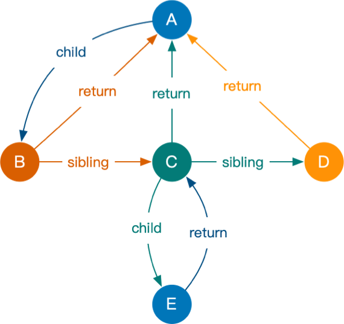

[toc]
# 0. 序言

fiber的出现是react为了解决庞大的虚拟dom树渲染不能中断, 阻塞主线程的问题.

fiber可以理解为一种数据结构, 一种架构, 一种解决方案等.

# 1. fiber出现原因

fiber的出现是react为了解决庞大的虚拟dom树渲染不能中断, 阻塞主线程的问题.

# 2. fiber原理

fiber是种使用链表构成的树形结构. 你可以在fiber树的任意节点开始遍历整棵树, 可以随时停下, 并随时继续.

fiber树的更新在不紧急的情况下进行, 遇到紧急任务则可以中断. 因为fiber树是一种**一边比较, 一边修改, 一边收集副作用的树**.

为了保证更新不占用主线程, 底层使用的是requestAnimateFrame.

参考[Window：requestAnimationFrame() 方法 - Web API | MDN](https://developer.mozilla.org/zh-CN/docs/Web/API/Window/requestAnimationFrame)



# 3. 并发渲染Concurrent Mode 

useSyncExternalStore 能够通过强制同步更新数据让 React 组件在 CM 下安全地有效地读取外接数据源。 在 Concurrent Mode 下，React 一次渲染会分片执行（以 fiber 为单位），中间可能穿插优先级更高的更新。假如在高优先级的更新中改变了公共数据（比如 redux 中的数据），那之前低优先的渲染必须要重新开始执行，否则就会出现前后状态不一致的情况。

两个重要api

## 3.1 startTransition

```jsx
import React, { useState, useEffect, useTransition } from 'react';

const App: React.FC = () => {
  const [list, setList] = useState<any[]>([]);
  const [isPending, startTransition] = useTransition();
  useEffect(() => {
    // 使用了并发特性，开启并发更新
    startTransition(() => {
      setList(new Array(10000).fill(null));
    });
  }, []);
  return (
    <>
      {list.map((_, i) => (
        <div key={i}>{i}</div>
      ))}
    </>
  );
};

export default App;
```

## 3.2 useDeferredValue

```jsx
import React, { useState, useEffect, useDeferredValue } from 'react';

const App: React.FC = () => {
  const [list, setList] = useState<any[]>([]);
  useEffect(() => {
    setList(new Array(10000).fill(null));
  }, []);
  // 使用了并发特性，开启并发更新
  const deferredList = useDeferredValue(list);
  return (
    <>
      {deferredList.map((_, i) => (
        <div key={i}>{i}</div>
      ))}
    </>
  );
};

export default App;

```


# 4. 参考

* [React Fiber 架构原理：关于 Fiber 树的一切 - 知乎](https://zhuanlan.zhihu.com/p/525244896)

* [React18 新特性解读 & 完整版升级指南React 18 正式版它来啦！一起来看看 React 18 有哪些新特性 - 掘金](https://juejin.cn/post/7094037148088664078)

